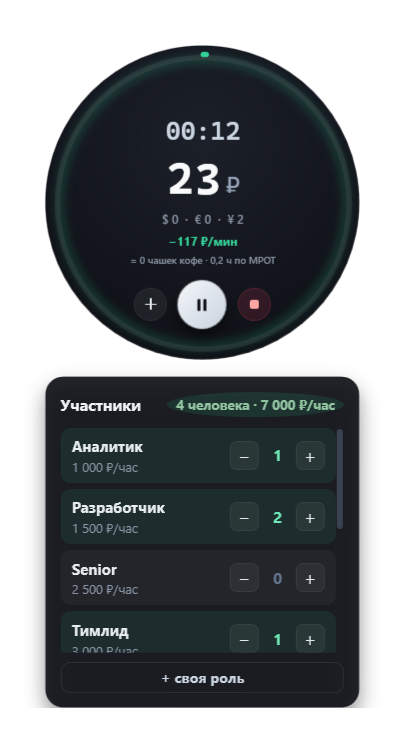
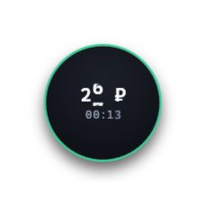
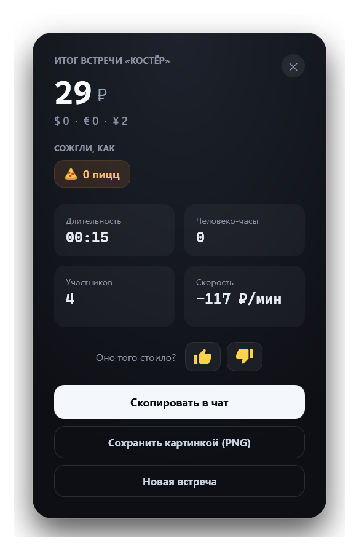
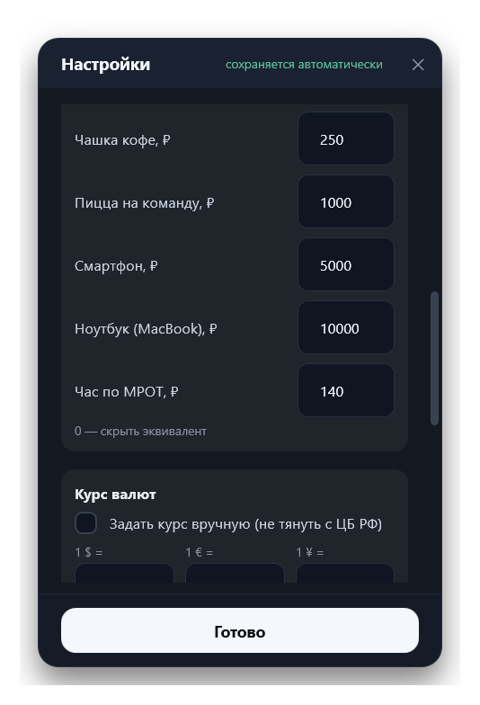
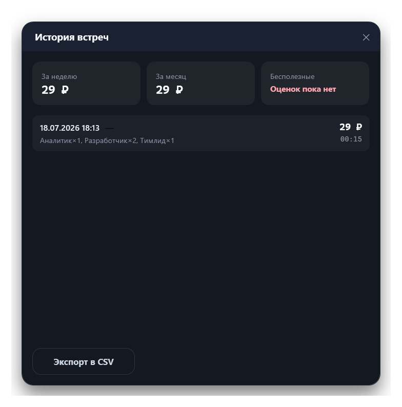

<!-- Репозиторий: GitHub · liveinno/meeting-burn-meter -->
<div align="center">

# 🔥 Костёр

### Круглый счётчик, который показывает стоимость созвона деньгами — в реальном времени

**Пока идёт встреча, «Костёр» горит поверх Zoom/Teams и считает, во сколько она обходится
компании — каждую секунду, по ставкам всех участников. Сумма растёт на глазах, и «ещё пять
минуточек» внезапно перестают быть бесплатными. Это не таск-трекер и не тайм-шит: это
маленький кружок, который делает цену совещаний видимой прямо на экране.**



<sub>Идёт встреча: время, сожжённая сумма, курсы $/€/¥, скорость ₽/мин и состав участников.</sub>

<video src="demo/github.mp4" width="620" controls muted loop playsinline>
  <a href="demo/github.mp4">▶ Демо-ролик (25 с) — demo/github.mp4</a>
</video>

<sub>▶ 25 секунд вживую: встреча идёт, деньги «горят», а огонь в кольце разгорается по мере роста суммы.</sub>

<br/>


</div>

---

## Зачем это нужно

Созвоны — самая незаметная статья расходов в команде. Восемь человек на «пятиминутке»,
которая идёт сорок минут, — это несколько тысяч рублей, которые нигде не отражаются: в
календаре встреча выглядит бесплатной, а в голове — «ну поговорили и поговорили». Дорого
обходятся именно те совещания, стоимость которых никто не видит.

«Костёр» превращает время в деньги прямо на экране. Запустили счётчик — и на прозрачном
кружке поверх Zoom растёт сумма по реальным ставкам участников. Добавили человека в середине
— стоимость ускорилась. Нажали «Стоп» — получили честную карточку: сколько сожгли, сколько
это в пиццах и человеко-часах, и кнопку «оно того стоило?». Видимая цена сама по себе делает
встречи короче и осмысленнее.

## Что делает его особенным

- ⏱️ **Деньги в реальном времени, а не по таймеру.** Сумма считается от часов, а не по тикам,
  поэтому на паузах и лагах не «плывёт». Крупные цифры прокручиваются как одометр — сразу видно,
  как горит бюджет.
- 🔄 **Состав меняется на лету — честно, «с этого момента».** Пришёл ещё разработчик в середине
  созвона — дороже станет только дальше. Задним числом ничего не пересчитывается: цена
  считается интегрально, как счётчик такси.
- 💸 **Полная стоимость, а не голый оклад.** Коэффициент overhead превращает ставку в реальную
  цену для компании (налоги, аренда, техника). Есть помощник «оклад/мес → ставка/час».
- 🟢 **Кольцо-светофор и живые эквиваленты.** Кольцо меняет цвет зелёный → жёлтый → оранжевый →
  красный по мере затягивания встречи. Рядом — «сгорела пицца на команду», «полетел MacBook»,
  «N часов по МРОТ»: абстрактные рубли становятся понятными.
- 🪟 **Прозрачный кружок поверх всех окон.** Всегда сверху, перетаскивается за любое место,
  сворачивается в мини-режим ~100px — чтобы висеть в углу шаринга и не мешать.
- 📊 **Итог, история и экспорт.** По «Стоп» — карточка со всеми валютами и оценкой; всё копится
  в локальную историю (суммы за неделю/месяц, доля бесполезных встреч, экспорт в CSV).
- 🔒 **Полностью офлайн и приватно.** Приложение вообще не ходит в сеть: всё считается и хранится
  только на вашем компьютере. Курс валют вы задаёте сами в настройках. Никакой телеметрии.

## Как это выглядит

| Мини-режим — поверх Zoom | Итог встречи |
|:---:|:---:|
|  |  |
| Клик по времени — и остаётся кружок ~100px с суммой и таймером. | Сумма в 4 валютах, человеко-часы, «сожгли, как N пицц», оценка 👍/👎. |

## Как это работает

```
   ставки ролей ×  количество  ×  overhead
            │
            ▼
   ┌──────────────────┐   каждую секунду    ┌────────────────────┐
   │    BurnEngine     │ ─────────────────▶ │  сумма ₽  + одометр │
   │ (интегральный     │                    │  кольцо-прогресс    │
   │  аккумулятор)     │ ◀── смена состава  │  $/€/¥ (курс из настроек)│
   └──────────────────┘     = flush          └────────────────────┘
            │                                          ▲
            ▼                                          │
   снимок сессии на диск раз в ~5 с          курс валют — локальный, без сети
```

1. Вы задаёте состав (роли и количество) — «Костёр» складывает ставки и умножает на overhead.
2. Пока счётчик идёт, сумма растёт от прошедшего времени; при смене состава накопленное
   фиксируется и дальше считается по новой ставке (интегрально).
3. Рубли переводятся в $/€/¥ по курсу, который вы задали в настройках (локально, без сети).
4. Состояние сохраняется на диск раз в ~5 с — после сбоя приложение предложит продолжить встречу.

## Скачать и установить

<div align="center">

### 👉 [Скачать со страницы релизов](https://github.com/liveinno/meeting-burn-meter/releases)

</div>

| Вариант | Что это | Установка |
|---|---|---|
| **Kostyor-Setup-1.0.0.exe** | Установщик с мастером, ярлыками и удалением через Windows | Двойной клик → мастер |
| **Kostyor.exe** (portable) | Один self-contained файл, без установки | Просто запустить |

**Шаги установки:**

1. Скачайте `Kostyor-Setup-1.0.0.exe` со страницы релизов.
2. Запустите. Первый старт может «висеть» 1–2 минуты — это антивирус/SmartScreen синхронно
   сканирует неподписанный файл. Наберитесь терпения и **не** запускайте установщик повторно.
3. Появится синее окно SmartScreen «Windows защитила ваш компьютер» — это нормально для
   неподписанных приложений. Нажмите **«Подробнее» → «Выполнить в любом случае»**.
4. Пройдите мастер: язык → лицензия → папка/права → (сброс настроек, если ставите поверх) → готово.

**Удаление** — стандартным способом Windows: «Параметры → Приложения → Костёр → Удалить».
Ваши данные (экспорт карточек в `Документы\Kostyor`) при удалении сохраняются.

<details>
<summary>🛠️ Сборка из исходников</summary>

Нужен [.NET 8 SDK](https://dotnet.microsoft.com/download) (и [Inno Setup 6](https://jrsoftware.org/isinfo.php) для установщика).

```bash
# Сборка и тесты
dotnet build Kostyor.sln -c Release
dotnet test  Kostyor.Core.Tests

# Запуск из исходников
dotnet run --project Kostyor.App -c Release

# Portable single-file .exe
dotnet publish Kostyor.App -c Release -r win-x64 --self-contained true -p:PublishSingleFile=true -o publish

# Установщик (Inno Setup 6)
bash packaging/build-installer.sh        # → installer/Output/Kostyor-Setup-<версия>.exe
```

UI-автотестер (FlaUI + локальная vision-модель) — в `Kostyor.UITests`, запускать из его папки.
Подробности разработки — в [AGENTS.md](AGENTS.md); набитые грабли — в [BUGS.md](BUGS.md).

</details>

## Настройки

Правый клик по кругу (или иконка в трее) → **Настройки**.

<div align="center">

</div>

Здесь настраивается всё, что влияет на подсчёт и внешний вид: **overhead** (полная нагрузка
1.0–2.3), за сколько минут заполняется **кольцо** и его цветовые пороги, **вехи-нотификации**
(на каких суммах показывать тосты), помощник **«оклад → ставка/час»**, показ
конвертации/пульсации/эквивалентов, **автозапуск** при входе в Windows и режим
**сквозных кликов**. Настройки сохраняются автоматически.

- **Эквиваленты «сожгли, как…».** Своя цена для чашки кофе, пиццы на команду, смартфона,
  ноутбука (MacBook) и часа по МРОТ — под свою команду и валюту. `0` скрывает эквивалент.
- **Курс валют.** Задаётся вручную в настройках — свои `1 $ / € / ¥ = ₽`. Приложение **не ходит
  в сеть** за курсами: значение целиком под вашим контролем (по умолчанию — разумные ориентиры).

## История встреч

Правый клик по кругу → **История**.

<div align="center">

</div>

Каждая завершённая встреча копится в локальную базу: сумма, длительность, состав, оценка
👍/👎. Сверху — сколько сожжено за неделю и за месяц и какая доля встреч оказалась
бесполезной. Всё можно выгрузить в **CSV** для своих отчётов.

## Обучение при первом запуске

На первом старте «Костёр» сам проводит короткий тур: золотая рамка по очереди подсвечивает
настоящие кнопки (старт, участники, стоп, мини-режим) и коротко объясняет, зачем каждая.
Тур можно пропустить в любой момент и запустить снова через меню (**Обучение**) или ярлык
`--coach`.

## Приватность

- **Всё локально.** Подсчёт, история и настройки хранятся только на вашем компьютере, в
  `%APPDATA%\Kostyor` (история — в `history.db`, логи — в `logs\`).
- **Приложение вообще не ходит в сеть** — ни за курсами, ни за обновлениями: ни телеметрии,
  ни аккаунтов, ни облака. Курс валют вы задаёте сами.
- **Ваши данные никому не отправляются** — состав встреч и суммы не покидают машину.

## Горячие клавиши

| Клавиши | Действие |
|---|---|
| `Ctrl` + `Alt` + `K` | Показать / скрыть кружок |
| `Ctrl` + `Alt` + `Space` | Старт / пауза |
| `Ctrl` + `Shift` + `C` | Режим захвата экрана (для скринов/тестера) |
| Клик по времени | Свернуть в мини-режим / развернуть |
| Правый клик по кругу | Меню: настройки, история, обучение, выход |

<sub>Если хоткей уже занят другой программой, «Костёр» не падает, а сообщает об этом в трее.</sub>

## Системные требования

- **ОС:** Windows 10 (1809+) или Windows 11, x64.
- **Рантайм:** не нужен — установщик и portable-версия self-contained (.NET 8 встроен).
- **Железо:** минимальное; приложение лёгкое, per-monitor DPI v2 (корректно на мониторах с масштабом).

## Лицензия

См. [LICENSE.txt](packaging/inno/LICENSE.txt). Программа предоставляется «как есть»; все права
на продукт принадлежат правообладателю. История изменений — в [CHANGELOG.md](CHANGELOG.md).

## Стек

C# 12 · .NET 8 · WPF (MVVM, CommunityToolkit.Mvvm) · H.NotifyIcon · Microsoft.Data.Sqlite ·
Inno Setup 6 · FlaUI (UI-автотесты)
